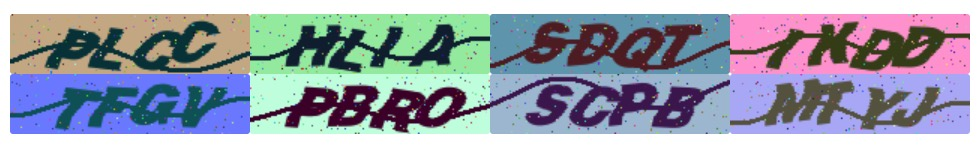

# 什么是 pycapt

[GitHub 欢迎提 pr，如果有bug或新需求 请反馈 issue]()

pycapt 是我在处理验证码时编写的一系列图像处理的算法包，你可以使用它来为图像去噪点、干扰线 以及分割验证码，pycapt 封装了一些关于图形矩阵的方法，例如将图片分割为标准化的矩阵、生成您所需要的训练集图片等，有助于您使用深度学习来进行图像识别。

pycapt 包括处理验证码和生成验证码两部分，多谢我的好友 [exqlnet](<https://github.com/exqlnet>) [ZhouYingSASA](<https://github.com/ZhouYingSASA>) 的共同帮助 发布 pycapt 1.0.1

### 依赖与安装

```bash
Pillow
numpy
```

```py
pip3 install pycapt
```

### 目录结构

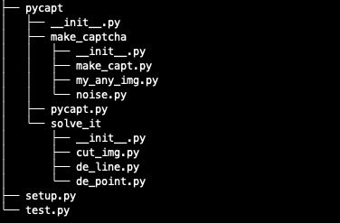

## 使用 pycapt 进行验证码图像处理

### 导入

```py
import pycapt
from PIL import Image
```


### 图像二值化

**two_valve : 二值化方法，必选参数img为图片，可选参数 Threshold** 是灰度阀值，这里可以选择适合的值，默认值是100 .  **返回新处理过的图片**

```py
img = Image.open('./img/frcc0.png')
img = pycapt.two_value(img,Threshold=100)
img.show()
```


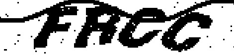

### 处理噪点

**dele_noise ：消除噪点方法，该方法使用的是八领域去噪点法，N是领域异点个数，Z是处理次数，处理次数越多 图形越圆滑**。

```py
img = pycapt.dele_noise(img,N=5,Z=2)
img.show()
```


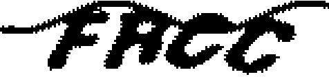

### 处理干扰线

**dele_line : 去除干扰线，删除连续的N个竖直像素。配合dele_noise方法使用效果更佳。**

```py
img = pycapt.dele_line(img,N=4)
img.show()
```

**配合dele_noise方法使用效果更佳。**

```py
img = pycapt.dele_line(img,4)
img = pycapt.dele_noise(img,N=4,Z=2)
img = pycapt.dele_line(img,3)
img = pycapt.dele_noise(img,N=4,Z=2)
img = pycapt.dele_line(img,3)
img = pycapt.dele_line(img,2)
img = pycapt.dele_line(img,1)
img.show()
```

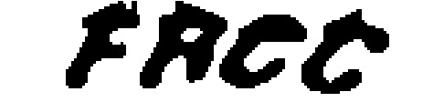

**想要更好的效果，你还可以先使用转置图片的 tran_90(img) 方法 再次使用去除干扰线的方法，最后再转置回来**

```py
img = pycapt.tran_90(img)
img.show()
img = pycapt.dele_line(img,3)
img = pycapt.dele_line(img,2)
img = pycapt.dele_line(img,1)
img = pycapt.tran_90(img)
img.show()
```

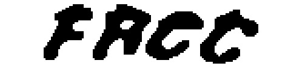

### 斜体矫正

**斜体矫正的目的是为了更好的分割与识别。**原理是平移，将每一行向左或向右平移不同距离，最后形成矫正的效果。pans就是矫正列表，正左负右平移。pans列表的元素个数需要是图片的高度，例子中图片 height 是40.

**rectify_img(img,pans) 返回新的图片。**

```py
pan = [18, 18, 18, 18, 17, 17, 17,\
        16, 16, 16, 15, 15, 15, 15, 14,\
        14, 14, 14, 13, 13, 10, 10,\
        10, 9, 9, 8, 7, 6, 5, 5, 4, \
        4, 4, 4, 4, 3, 1, 0, 0, 0]
img = pycapt.rectify_img(img,pans=pan)
img.show()
```

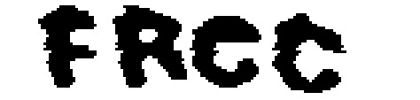

如果你觉得太难看了，可以提前使用矫正再使用 dele_line 和 dele_noise, 当然亡羊补牢也不太坏。

```py
img = pycapt.rectify_img(img,pans=pan)
img = pycapt.dele_line(img,3)
img = pycapt.dele_line(img,2)
img = pycapt.dele_line(img,1)
img.show()
```

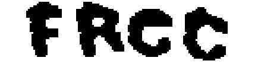


### 图形分割

**cut_img_to_img_list** 设置单个图片合适长度后切割，返回该长度的切割图片，该长度可以设置的比较大，该方法会在切割图片的两边补白。你可以将这作为一种标准化图片的方法。

```py
img = Image.open('1.png')
img_list = pycapt.cut_img_to_img_list(img,max_width=30,background=255)
for i in img_list:
    i.show()
```

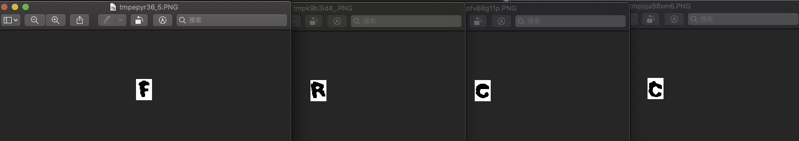

当你使用**深度学习**时，还可以使用 **cut_img_to_mode_list(image,max_width) **来获得标准化的数组。

### 图片裁剪

当你的图片 height 可以压缩时，可以使用 **small_img(img,box)** 来裁剪图片，这样可以减少之后学习的计算量。

例如

## 使用 pycapt 生成验证码训练集

### do_captcha 生成验证码训练集

width 验证码图片长度，height 验证码高度，num_of_str 验证码上字符数量 默认4，font 字体大小 默认30，gray_value 灰度值 默认255，font_family 字体文件，在这里可以选择你需要的粗细，样式等，但前提是你电脑上有这种字体。

如果你不知道自己电脑有哪些字体，请点击 [**这里**](<https://www.yuque.com/zhiwa/deepin/ahimr7>) 。

```py
name,img = pycapt.do_captcha(
        my_str_list=['A','B','C','D','1','2','3'],
        width=160,
        height=40,
        num_of_str=4,
        font=30,
        gray_value=255,
        font_family='ヒラギノ角ゴシック W8.ttc')

print(name)
img.show()

# output： ['C', 'D', '2', 'A']
```

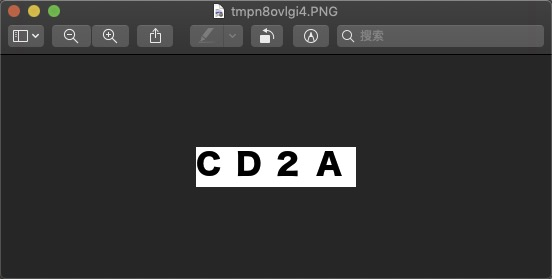

### 增加噪点

**more_noise ：N是加噪率，0 < N < 1，Z为处理次数**

```py
img = pycapt.more_noise(img,N=0.5,Z=2)
```

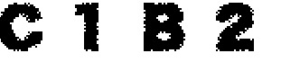

### 偏移

```py
img = pycapt.img_pan(img,10,3)
```

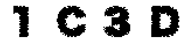

### 倾斜

**还是和之前一样 使用 rectify_img** 

```py
pan = [18, 18, 18, 18, 17, 17, 17,\
        16, 16, 16, 15, 15, 15, 15, 14,\
        14, 14, 14, 13, 13, 10, 10,\
        10, 9, 9, 8, 7, 6, 5, 5, 4, \
        4, 4, 4, 4, 3, 1, 0, 0, 0]
img = pycapt.rectify_img(img,pans=pan)
```

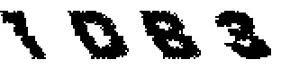

### 加去噪点 变平滑

**clear_train_img 相当于 dele_line(line,N) 分别对line消除了N=4，3，2，1 的4次噪点，也就相当于纵向变平滑了**

```py
img = pycapt.show_noise_img(img,0.1,1)
img = pycapt.dele_noise(img,5,2)
img = pycapt.clear_train_img(img)
```

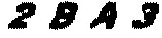

这里 你完全可以使用pycapt生成深度学习验证码的训练集了。

那如果想要更方便点呢？ 请看这里。

### 直接生成训练集的方法

train_img 返回训练集图片，my_str_list，你的字符集列表，width height 长度高度，num_of_str 显示在验证码图片上的字符串个数，会从你的 my_str_list 中随机挑选，font 显示的字体大小，xpan ypan 左右与上下随机偏移尺寸，rotate 字符随机旋转尺度，noise_N 加噪率（0 < N < 1），noise_Z 加噪次数，gray_value 背景灰度，默认白色，font_family 字体样式，如果你不知道自己电脑有哪些字体，请点击 [**这里**](<https://www.yuque.com/zhiwa/deepin/ahimr7>) 。

```py
filename,img = pycapt.train_img(
    my_str_list=['A','B','C','D','E'],
    width=30,
    height=32,
    num_of_str=1,
    font=30,
    xpan=3,
    ypan=2,
    rotate=15,
    noise_N=0.3,
    noise_Z=2,
    gray_value=255,
    font_family='ヒラギノ角ゴシック W8.ttc')
```

只要你再写一个循环，**img.save('train_img/{}.png'.format(file_name))** 就可以生成成千上万张训练集图片 获取标签只需要 name = file_name[0] 就可以惹。

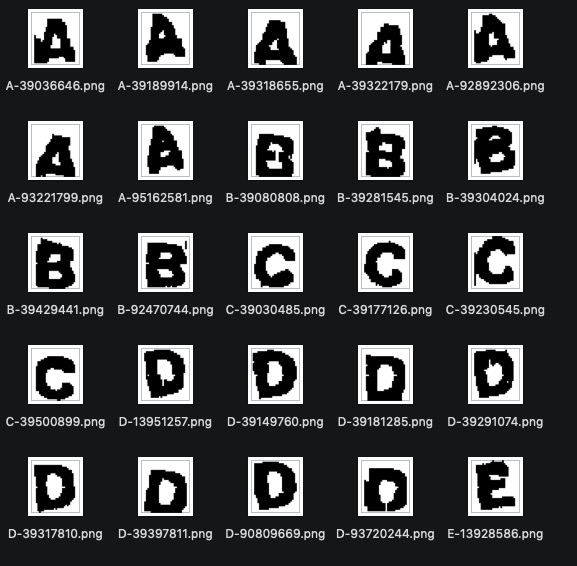

## Last

理论上只要你使用 pycapt 处理图片，调用各方法，并使用 train_img 方法 ,理论上可以解决90%验证码处理和模拟生成问题，欢迎 star pr 和提issue，如果你想更了解其中的原理，点击[这里](https://www.yuque.com/zhiwa/deepin/og0te8)，期望听见你的想法或pr。

### 捐赠

如果有所帮助 [请我喝一碗茶](https://www.yuque.com/zhiwa/deepin/hwnhg0)~

